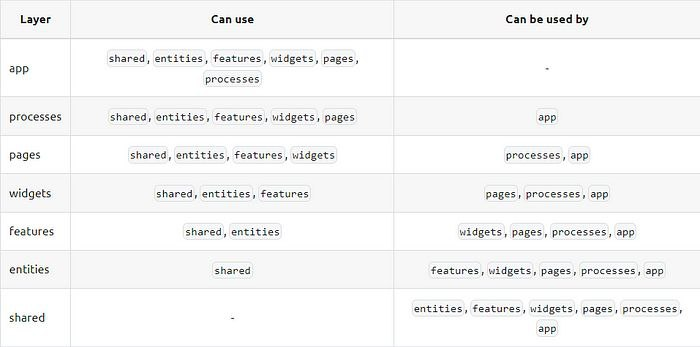

# STARPETSGG Frontend Task

# О проекте 

**Название:**  STARPETSGG Cyrrency Converter

Описание: Приложение для отслеживания курса валют и конвертации. Пользователи могут просматривать текущие курсы, конвертировать валюты.

## Технологии
 [Vue 3 Composition API](https://vuejs.org){:target="_blank" rel="noopener noreferrer"} -   Использование синтаксиса  `<script setup>`  
 для определения состояния и вычислений прямо в шаблоне компонента.  
 Объединение преимуществ Composition API и  `<script setup>`  для создания более модульных и гибких компонентов.

[TypeScript](https://www.typescriptlang.org){:target="_blank" rel="noopener noreferrer"} для типизации

[Vue Router](https://router.vuejs.org){:target="_blank" rel="noopener noreferrer"} для навигации между страницами

[Pinia](https://pinia.vuejs.org){:target="_blank" rel="noopener noreferrer"} для управления состоянием приложения

[UnoCSS](https://unocss.dev){:target="_blank" rel="noopener noreferrer"} для оптимизации CSS и удаления неиспользуемого кода

[Vite](https://vitejs.dev){:target="_blank" rel="noopener noreferrer"} для сборки и оптимизации приложения

# **Архитектура**

### Feature Sliced Design

[Feature Sliced Design](https://feature-sliced.design){:target="_blank" rel="noopener noreferrer"} (FSD) - это архитектурный подход, который фокусируется на разделении приложения на независимые фичи (features), каждая из которых имеет собственную бизнес-логику, данные и представление.

#### Основные принципы FSD

-   **Фичи**  (features): каждая фича представляет собой независимую единицу функциональности, которая имеет свой бизнес-логику, данные и представление.
-   **Срезы**  (slices): каждый срез представляет собой набор фич, которые связаны между собой и имеют общую бизнес-логику.
-   **Виджеты**  (widgets): каждый виджет представляет собой отдельный компонент, который реализует определенный функционал.

#### Преимущества FSD

-   **Легкость поддержки**: FSD позволяет легко поддерживать и обновлять приложение, поскольку каждая фича и срез имеют свой собственный бизнес-логику и данные.
-   **Легкость масштабирования**: FSD позволяет легко масштабировать приложение, поскольку каждая фича и срез могут быть независимыми или зависимыми от других фич и срезов.
-   **Повышение читабельности**: FSD позволяет повысить читабельность кода, поскольку каждая фича и срез имеют свой собственный бизнес-логику и данные.

# **Установка и запуск**

### Требования к окружению

-   Node.js версии 14 или выше
-   npm версии 6 или выше
-   Vite версии 2 или выше

>### Установка зависимостей

#### Шаг 1: Клонирование репозитория

`git clone https://github.com/your-repo/starpetsgg-frontend-task.git`

#### Шаг 2: Переход в папку проекта

`cd starpetsgg-frontend-task`

#### Шаг 3: Установка зависимостей с помощью npm

`npm  install`

#### Шаг 4: Установка Vite с помощью npm

`npm  install vite -D`

> ### Запуск проекта

#### Шаг 1: Запуск проекта с помощью Vite

`npm run dev`

#### Шаг 2: Открытие браузера и переход по адресу

[http://localhost:3000](http://localhost:3000/)

### Сборка проекта

#### Шаг 1: Сборка проекта с помощью Vite

`npm run build`

#### Шаг 2: Запуск собранного проекта с помощью Vite

`npm run serve`
